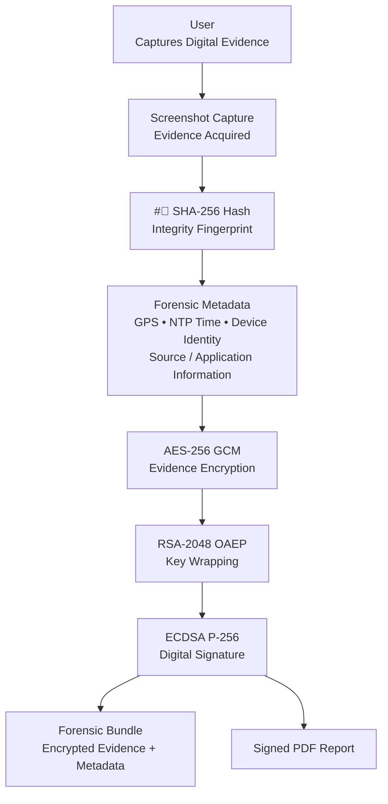
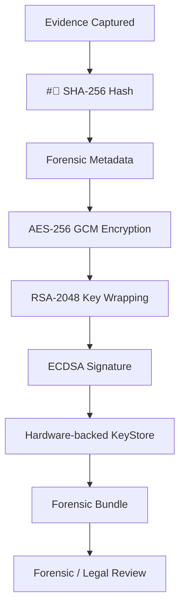
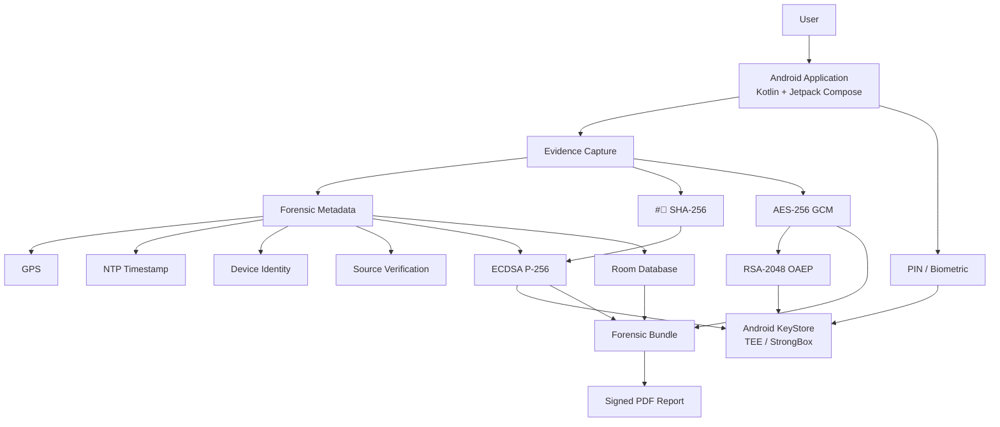
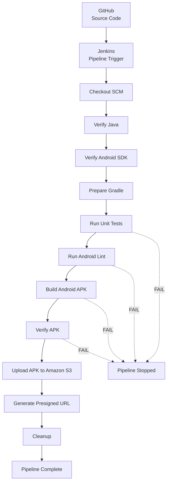

# EVIDA — Forensic Evidence Capture Application

## Capture. Protect. Verify. Preserve.

EVIDA is a forensic-grade Android application built to capture, protect, verify, manage, and export digital evidence while preserving its cryptographic integrity and forensic metadata.

---

## About EVIDA

**EVIDA (Evidence Capture Application)** addresses a fundamental problem with conventional screenshots: digital evidence can be modified or fabricated after capture, making its integrity and provenance difficult to establish.

EVIDA turns a simple screenshot into a controlled forensic evidence workflow.

At the time of capture, the application associates the evidence with forensic information such as:

- GPS coordinates
- NTP-based timestamps
- Device identity
- Source/application information
- Cryptographic integrity information

The captured evidence is protected through multiple cryptographic layers and can then be exported as a forensic bundle containing the encrypted evidence and a signed PDF report.

---
# The Problem

Digital evidence such as screenshots and screen recordings can be easily modified after capture.

Traditional screenshot tools generally do not provide:

- Cryptographic integrity verification
- Provenance information
- Hardware-backed key protection
- A forensic chain of custody
- Trusted timestamps
- Evidence-oriented export packages

EVIDA addresses these gaps by combining evidence capture with cryptographic protection, forensic metadata, hardware-backed security, and controlled evidence export.

---
# What EVIDA Actually Does

EVIDA takes a conventional screenshot and turns it into a structured digital-evidence workflow.

## Evidence Processing Workflow



---
# Security Model

EVIDA uses several security layers to protect captured evidence.

| Security Layer | Technology | Purpose |
|---|---|---|
| Evidence Encryption | **AES-256 GCM** | Encrypts captured evidence |
| Key Wrapping | **RSA-2048 OAEP** | Protects the AES session key |
| Digital Signature | **ECDSA P-256** | Signs evidence metadata and integrity information |
| Integrity Hash | **SHA-256** | Generates an integrity fingerprint |
| Hardware Security | **Android KeyStore / TEE / StrongBox** | Protects sensitive cryptographic keys |
| Location | **GPS** | Records capture location |
| Trusted Time | **NTP** | Provides trusted timestamp information |
| Authentication | **Biometric / PIN** | Controls access to protected evidence |
| Local Metadata | **Room** | Stores application and evidence metadata |

---
# Forensic Chain of Custody

EVIDA keeps a traceable link between the original capture and the exported evidence.



---
# Encryption & Decryption

## Encryption

### 1. Capture + Hash

The screenshot is captured and hashed using **SHA-256**.

```text
Screenshot
 ↓
SHA-256
 ↓
Integrity Anchor
```

### 2. Evidence Encryption

An ephemeral **AES-256 GCM** session key encrypts the screenshot.

```text
Screenshot + AES-256 Session Key
 ↓
 Encrypted Evidence
```

### 3. Key Wrapping

The AES session key is protected using the forensic authority's **RSA-2048 public key**.

```text
AES Session Key
 ↓
RSA-2048 OAEP
 ↓
Wrapped AES Key
```

### 4. Digital Signing

Android KeyStore-backed security is used to sign metadata and SHA-256 integrity information.

---

## Decryption

The decryption workflow is:

```text
Biometric / PIN Authentication
 ↓
Unlock Hardware KeyStore
 ↓
Fetch Wrapped AES Key
 ↓
Unwrap AES Session Key
 ↓
Recalculate Evidence Hash
 ↓
Verify Integrity
 ↓
AES-256 GCM Decryption
 ↓
View Decrypted Evidence
```

The evidence integrity is verified before the protected evidence is decrypted for viewing.

---
# Application Workflow

EVIDA provides a complete workflow for capturing, protecting, reviewing, and exporting evidence.

### 1⃣ Welcome / Initialization

The application starts in the secure EVIDA forensic environment.

### 2⃣ System Readiness

The application verifies required components such as:

- GPS
- Widget overlay
- Usage telemetry
- Screen capture

### 3⃣ Secure PIN Setup

The user creates a six-digit PIN to protect the forensic environment.

### 4⃣ Forensic Dashboard

The dashboard shows security and application status information.

### 5⃣ Evidence Capture

The user captures digital evidence from the device.

### 6⃣ Evidence Protection

The captured evidence is:

- Hashed
- Encrypted
- Signed
- Associated with forensic metadata

### 7⃣ Evidence List

Captured evidence can be viewed and managed from the evidence section of the application.

### 8⃣ Decryption & Verification

Authorized users can access protected evidence after authentication and successful integrity verification.

### 9⃣ Forensic Report

Evidence can be exported with a signed PDF report for forensic and legal documentation.

---
# Forensic Bundle

EVIDA produces a forensic export package that contains the encrypted evidence and its associated report.

```text
Forensic Bundle
│
├── Encrypted Evidence
│
└── Signed PDF Report
 │
 ├── Evidence Metadata
 ├── Integrity Information
 └── Verification Information
```

The overall evidence handoff workflow is:

```text
User Capture
 ↓
Encrypt + Sign
 ↓
Forensic Bundle
 ↓
Forensic Authority / Police Lab
 ↓
Decryption + Analysis
 ↓
Legal Documentation
```

---
# Technical Architecture



---
# Technology Stack

## Android

- Kotlin
- Jetpack Compose
- Material 3
- Android KeyStore
- TEE / StrongBox
- Room Persistence Library
- Kotlin Coroutines
- Kotlin Flow

## Cryptography

- AES-256 GCM
- RSA-2048 OAEP
- ECDSA P-256
- SHA-256

## Infrastructure & DevOps

- GitHub
- Jenkins
- AWS
- Amazon S3
- Terraform
- Gradle

The project specifies Android API 24 as the minimum SDK and API 36 as the target SDK.

---
# CI/CD Pipeline

EVIDA uses Jenkins to automatically validate the Android application, build the APK, verify the generated artifact, and upload it to Amazon S3.

## CI/CD Architecture

The pipeline follows a **vertical quality-gated workflow**:



## Pipeline Stages

| Stage | Responsibility |
|---|---|
| **Checkout SCM** | Retrieves the source code from GitHub |
| **Verify Java** | Confirms the Java environment |
| **Verify Android SDK** | Confirms Android SDK availability |
| **Prepare Gradle** | Prepares the Gradle wrapper for Jenkins |
| **Run Unit Tests** | Executes Android unit tests |
| **Run Android Lint** | Performs static code analysis |
| **Build Android APK** | Builds `app-debug.apk` |
| **Verify APK** | Confirms the APK was generated |
| **Upload APK to S3** | Stores the APK as a cloud artifact |
| **Generate Presigned URL** | Creates temporary access to the artifact |
| **Cleanup** | Cleans the Jenkins workspace |

### Quality Gate

The pipeline is intentionally kept sequential.

```text
Unit Tests
 ↓
Android Lint
 ↓
APK Build
 ↓
APK Verification
 ↓
S3 Upload
```

If a required validation or build stage fails, the later artifact-delivery stages do not execute.

---
# AWS Artifact Delivery

After the Jenkins pipeline successfully builds and verifies the APK:

```text
app-debug.apk
 ↓
 Jenkins
 ↓
 Amazon S3
 ↓
Presigned URL
```

The APK remains stored in Amazon S3 while the presigned URL provides temporary access to the artifact.

---
# Infrastructure as Code

The cloud infrastructure configuration is maintained in:

```text
terraform/
```

Terraform defines and manages the infrastructure required for the CI/CD environment.

Typical workflow:

```bash
terraform init
terraform plan
terraform apply
```

> **Security:** Never commit AWS access keys, private keys, passwords, Terraform state containing sensitive values, or other secrets to the repository.

---
# Repository Structure

```text
EVIDA/
│
├── app/
│ └── Android application source
│
├── gradle/
│ └── Gradle configuration
│
├── terraform/
│ ├── main.tf
│ ├── provider.tf
│ └── .terraform.lock.hcl
│
├── Jenkinsfile
├── lint.xml
│
├── build.gradle.kts
├── settings.gradle.kts
├── gradle.properties
│
├── gradlew
├── gradlew.bat
│
├── .gitignore
├── PHASE_1_FORENSIC_REPORT.md
└── README.md
```

---
# ▶ Running the Android Project

Before running the project, make sure the required Android development environment is installed.

## Build the Debug APK

```bash
./gradlew assembleDebug
```

## Run Unit Tests

```bash
./gradlew testDebugUnitTest
```

## Run Android Lint

```bash
./gradlew lintDebug
```

## Clean the Project

```bash
./gradlew clean
```

The generated debug APK will be available at:

```text
app/build/outputs/apk/debug/app-debug.apk
```

---
# Key Features

### Forensic Security

- Hardware-backed key protection
- AES-256 GCM evidence encryption
- RSA-2048 OAEP key wrapping
- ECDSA P-256 digital signatures
- SHA-256 evidence integrity hashing

### Evidence Context

- GPS coordinates
- NTP-based timestamping
- Device identity
- Source/application verification
- Forensic metadata

### Evidence Management

- Secure evidence capture
- Evidence list
- Protected local metadata
- Authentication-controlled access
- Evidence decryption and verification

### Forensic Export

- Encrypted evidence
- Signed PDF report
- Forensic bundle generation
- Evidence handoff for forensic workflows

---

## EVIDA

**Secure the evidence. Preserve its integrity. Protect the truth.**
