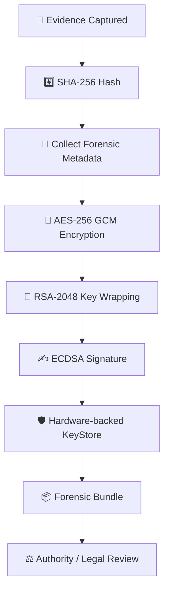
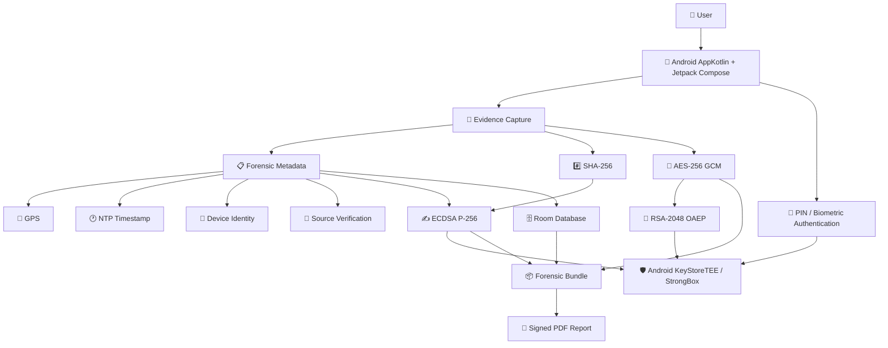
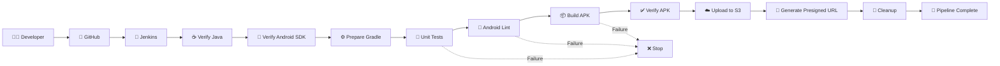

# 🛡️ EVIDA — Forensic Evidence Capture Application
## 🛡️ Capture. Protect. Verify. Preserve.
A forensic-grade Android application designed to capture, secure, manage, and export digital evidence with cryptographic integrity and chain-of-custody metadata.
---
## 📖 About EVIDA
**EVIDA (Evidence Capture Application)** is a forensic-grade Android mobile application for capturing and managing digital evidence.
The central problem EVIDA addresses is simple:
> **A normal screenshot can be edited, fabricated, or tampered with, making it difficult to establish its integrity and provenance.**
EVIDA turns ordinary screenshot capture into a controlled forensic evidence workflow. At the point of capture, the application records evidence integrity information and binds the captured content to forensic metadata such as **GPS coordinates, NTP-based timestamps, device identity, and application/source verification**.
The evidence is protected using multiple cryptographic layers, stored with associated metadata, and can be exported as a **forensic bundle containing encrypted evidence and a signed PDF report**.
This project is intended for use cases involving **cybercrime, online harassment, fraud, digital defamation, legal documentation, and digital-forensics workflows**.
The project's domain, problem statement, architecture, and technical design are documented in the EVIDA project report.
---
# 🎯 The Problem
Digital evidence such as screenshots and screen recordings can be easily modified after capture.
Traditional screenshot tools generally do not provide:
- ❌ Cryptographic integrity verification
- ❌ Provenance information
- ❌ Hardware-backed key protection
- ❌ A forensic chain of custody
- ❌ Trusted timestamps
- ❌ Evidence-oriented export packages
EVIDA was designed to address these gaps by binding each capture to **hardware-backed security, GPS coordinates, NTP timestamping, and device identity**. The project report identifies the lack of real-time forensic capture and cryptographic chain-of-custody mechanisms as key gaps in existing approaches.
---
# 💡 What EVIDA Actually Does
At a high level, EVIDA follows this workflow:
```text
 ┌──────────────────────┐
 │ USER │
 │ Captures digital │
 │ evidence │
 └──────────┬───────────┘
 │
 ▼
 ┌──────────────────────┐
 │ SCREEN CAPTURE │
 │ Screenshot acquired │
 └──────────┬───────────┘
 │
 ▼
 ┌──────────────────────┐
 │ SHA-256 HASH │
 │ Integrity fingerprint│
 └──────────┬───────────┘
 │
 ▼
 ┌──────────────────────────────────┐
 │ FORENSIC METADATA │
 │ GPS • NTP Time • Device Identity│
 │ Source/App information │
 └────────────────┬─────────────────┘
 │
 ▼
 ┌──────────────────────┐
 │ AES-256 GCM │
 │ Encrypt evidence │
 └──────────┬───────────┘
 │
 ▼
 ┌──────────────────────┐
 │ RSA-2048 OAEP │
 │ Wrap AES session key │
 └──────────┬───────────┘
 │
 ▼
 ┌──────────────────────┐
 │ ECDSA P-256 │
 │ Sign metadata/hash │
 └──────────┬───────────┘
 │
 ▼
 ┌──────────────────────┐
 │ FORENSIC EVIDENCE │
 │ BUNDLE │
 │ Encrypted evidence │
 │ + signed PDF report │
 └──────────────────────┘
```
The documented encryption flow starts by hashing the screenshot with SHA-256, encrypting it with an ephemeral AES-256 session key, wrapping that key with the forensic authority's RSA-2048 public key, and signing metadata/hash information through Android KeyStore-backed hardware security.
---
# 🔐 Security Model
EVIDA uses multiple security layers rather than relying on a single encryption mechanism.
| Security Layer | Technology | Purpose |
|---|---|---|
| 🔏 Evidence Encryption | **AES-256 GCM** | Encrypts the captured evidence. |
| 🔑 Key Wrapping | **RSA-2048 OAEP** | Protects the AES session key using the forensic authority's public key. |
| ✍️ Digital Signature | **ECDSA P-256** | Provides cryptographic signing of evidence metadata/hash information. |
| #️⃣ Integrity Hash | **SHA-256** | Creates an integrity fingerprint for the captured evidence. |
| 🛡️ Hardware Security | **Android KeyStore / TEE / StrongBox** | Generates and protects sensitive keys using hardware-backed security. |
| 📍 Location | **GPS** | Records location information associated with the capture. |
| 🕐 Trusted Time | **NTP** | Provides atomic/tamper-resistant timestamping for capture events. |
| 🔐 User Authentication | **Biometric / PIN** | Controls access to the protected evidence environment. |
| 🗄️ Local Metadata | **Room** | Stores encrypted/local evidence metadata. |
These technologies and their intended roles are specified in the project's technical architecture.
---
# ⛓️ Forensic Chain of Custody
A major goal of EVIDA is to maintain a traceable relationship between the original capture and the exported evidence.

The project identifies GPS, NTP timestamp, device identity, source verification, encryption, signing, and export as parts of its forensic chain-of-custody approach.
---
# 🔄 Encryption & Decryption
## Encryption
The documented encryption process consists of four main steps:
### 1. Capture + Hash
The screenshot is captured and immediately hashed using **SHA-256**.
```text
Screenshot
 ↓
SHA-256
 ↓
Integrity Anchor
```
### 2. Digital Enveloping
An ephemeral **AES-256** session key encrypts the screenshot.
```text
Screenshot + AES-256 Session Key
 ↓
 Encrypted Evidence
```
### 3. Key Wrapping
The AES session key is wrapped using the forensic authority's **RSA-2048 public key**.
```text
AES Session Key
 ↓
RSA-2048 OAEP
 ↓
Wrapped AES Key
```
### 4. Hardware-backed Signing
Android KeyStore-backed security signs the metadata and SHA-256 hash to establish the cryptographic chain of custody.
These four encryption steps are described in the project's encryption/decryption process documentation.
---
## 🔓 Decryption
EVIDA's documented decryption workflow is:
```text
Biometric / PIN Authentication
 ↓
 Unlock Hardware KeyStore
 ↓
 Fetch Wrapped AES Key
 ↓
 Unwrap AES Session Key
 ↓
 Recalculate Evidence Hash
 ↓
 Verify Integrity
 ↓
 AES-256 GCM Decryption
 ↓
 View Decrypted Evidence
```
The system re-hashes the evidence and verifies its integrity before decrypting it for viewing.
---
# 📱 Application Workflow
EVIDA is more than a background encryption utility. It provides a complete user-facing workflow.
### 1️⃣ Welcome / Initialization
The application starts with the EVIDA secure forensic environment.
### 2️⃣ System Readiness
Before evidence capture, the application verifies required forensic modules such as:
- GPS coordinates
- Widget overlay
- Usage telemetry
- Screen capture
### 3️⃣ Secure PIN Setup
The user creates a six-digit PIN used to protect the forensic environment.
### 4️⃣ Forensic Dashboard
The home screen provides the current security/core status and monitoring information.
### 5️⃣ Evidence Capture
The user captures digital evidence from the device.
### 6️⃣ Evidence Protection
The capture is hashed, encrypted, signed, and associated with forensic metadata.
### 7️⃣ Evidence List
Captured evidence can be viewed and managed through the evidence section.
### 8️⃣ Decryption & Verification
Authorized access allows the evidence to be decrypted after authentication and integrity verification.
### 9️⃣ Forensic Report
The evidence can be exported together with a signed PDF report for documentation and further forensic/legal handling.
The project report includes application screenshots showing the Welcome Page, Permissions/System Readiness, PIN Setup, Home Screen, Evidence List, and Decrypted Evidence with report.
---
# 📦 Forensic Bundle
EVIDA produces a forensic export package containing:
```text
Forensic Bundle
│
├── 🔐 Encrypted Evidence
│
└── 📄 Signed PDF Report
 │
 ├── Evidence metadata
 ├── Integrity information
 └── Verification information
```
The intended workflow is:
```text
User Capture
 ↓
Encrypt + Sign
 ↓
Export Forensic Bundle
 ↓
Forensic Authority / Police Lab
 ↓
Decryption + Analysis
 ↓
Legal Documentation
```
The stakeholder map in the project report describes this flow from user capture through encryption/signing, forensic export, authority decryption, and legal use.
---
# 👥 Intended Users
EVIDA is designed around several stakeholders:
| Stakeholder | How EVIDA Helps |
|---|---|
| 👤 **End Users / Victims** | Capture, securely store, and export digital evidence. |
| 👮 **Forensic Authorities / Police Labs** | Receive encrypted forensic bundles for decryption and analysis. |
| ⚖️ **Legal Professionals** | Use signed PDF reports and hash verification as supporting documentation. |
| 📱 **Android OS / Hardware** | Provides KeyStore-backed key generation, secure storage, and biometric authentication. |
| 🕐 **NTP Server** | Provides trusted timestamp information for capture events. |
These stakeholder roles are defined in the project's systems and stakeholder map.
---
# 🏗️ Technical Architecture

The technical architecture specifies Kotlin, Jetpack Compose/Material 3, Room, Kotlin Coroutines/Flow, Android KeyStore with TEE/StrongBox, and the project's cryptographic stack.
---
# 🧰 Technology Stack
### 📱 Android
- **Kotlin**
- **Jetpack Compose**
- **Material 3**
- **Android KeyStore**
- **TEE / StrongBox**
- **Room Persistence Library**
- **Kotlin Coroutines**
- **Kotlin Flow**
### 🔐 Cryptography
- **AES-256 GCM**
- **RSA-2048 OAEP**
- **ECDSA P-256**
- **SHA-256**
### ☁️ Infrastructure & DevOps
- **Jenkins**
- **GitHub**
- **AWS**
- **Amazon S3**
- **Terraform**
- **Gradle**
The project specifies Android API 24 as the minimum SDK and API 36 as the target SDK.
---
# 🚀 CI/CD Pipeline
The Android application is supported by a Jenkins CI/CD pipeline that automates validation and artifact generation.

### Pipeline stages
| Stage | Responsibility |
|---|---|
| **Checkout SCM** | Retrieves the project from GitHub. |
| **Verify Java** | Confirms the Java build environment. |
| **Verify Android SDK** | Confirms Android SDK availability. |
| **Prepare Gradle** | Prepares the Gradle wrapper for Jenkins execution. |
| **Run Unit Tests** | Executes Android debug unit tests. |
| **Run Android Lint** | Performs static analysis. |
| **Build Android APK** | Generates `app-debug.apk`. |
| **Verify APK** | Confirms that the APK was generated. |
| **Upload APK to S3** | Stores the build artifact in Amazon S3. |
| **Generate Presigned URL** | Creates temporary artifact access. |
| **Cleanup** | Cleans the Jenkins workspace. |
This keeps application development and infrastructure work connected to a repeatable build-and-delivery process.
---
# ☁️ AWS Artifact Delivery
After a successful Android build:
```text
app-debug.apk
 │
 ▼
Jenkins
 │
 ▼
Amazon S3
 │
 ▼
Presigned Download URL
```
The APK is stored as a build artifact in S3, and the pipeline can generate a temporary presigned download URL.
This allows the artifact to remain in S3 without requiring the object itself to be permanently public.
---
# 🧱 Infrastructure as Code
The infrastructure configuration is maintained under:
```text
terraform/
```
Terraform is used to represent the cloud infrastructure required by the CI/CD environment.
Typical workflow:
```bash
terraform init
terraform plan
terraform apply
```
> ⚠️ Never commit AWS access keys, private keys, passwords, Terraform state containing sensitive values, or other secrets to the repository.
---
# 📁 Repository Structure
```text
EVIDA/
│
├── 📱 app/
│ └── Android application source
│
├── ⚙️ gradle/
│ └── Gradle wrapper/configuration
│
├── 🧱 terraform/
│ ├── main.tf
│ ├── provider.tf
│ └── .terraform.lock.hcl
│
├── 🔧 Jenkinsfile
├── 🔎 lint.xml
│
├── build.gradle.kts
├── settings.gradle.kts
├── gradle.properties
│
├── gradlew
├── gradlew.bat
│
├── .gitignore
├── PHASE_1_FORENSIC_REPORT.md
└── README.md
```
---
# ▶️ Running the Android Project
Make sure the required Android development environment is installed.
### Build the debug APK
```bash
./gradlew assembleDebug
```
### Run unit tests
```bash
./gradlew testDebugUnitTest
```
### Run Android Lint
```bash
./gradlew lintDebug
```
### Clean the project
```bash
./gradlew clean
```
The generated debug APK is expected under:
```text
app/build/outputs/apk/debug/app-debug.apk
```
---
# 🧪 CI/CD Quality Gates
The pipeline intentionally places automated validation before artifact delivery:
```text
 CODE
 │
 ▼
 Unit Tests
 │
 PASS │
 ▼
 Android
 Lint
 │
 PASS │
 ▼
 APK Build
 │
 PASS │
 ▼
 APK Verify
 │
 PASS │
 ▼
 S3 Upload
```
A failure in a required quality/build stage prevents the later artifact-delivery stages from continuing.
---
# 📸 Application Screens
The project documentation demonstrates the application through screenshots of:
1. **Welcome Page**
2. **System Readiness / Permissions**
3. **PIN Setup**
4. **EVIDA Core Home Screen**
5. **Evidence List**
6. **Decrypted Evidence with Report**
These screenshots demonstrate the progression from secure initialization to evidence management and report generation.
> **Recommended GitHub enhancement:** place the actual application screenshots inside a repository folder such as `docs/screenshots/` and reference them here using relative Markdown image paths.
Example:
```markdown

```
---
# 🌟 Key Features
### 🔐 Forensic Security
- Hardware-backed key protection
- AES-256 GCM evidence encryption
- RSA-2048 OAEP key wrapping
- ECDSA P-256 digital signatures
- SHA-256 evidence integrity hashing
### 📍 Evidence Context
- GPS coordinates
- NTP-based timestamping
- Device identity
- Source/application verification
- Environmental forensic metadata
### 📱 Evidence Management
- Secure evidence capture
- Evidence list
- Protected local metadata
- Authentication-controlled access
- Evidence decryption and verification
### 📄 Forensic Export
- Encrypted evidence
- Signed PDF report
- Forensic bundle generation
- Evidence handoff for authority/forensic workflows
The project also describes a **Forensic Integrity Score (0–100)** intended to automatically assess evidence trustworthiness at capture time.
---
# 🎓 Project Outcome
EVIDA demonstrates an end-to-end approach to **forensic evidence capture, protection, verification, management, and export** on Android.
The project combines:
```text
📱 Android
 +
🔐 Applied Cryptography
 +
🛡️ Hardware-backed Security
 +
📍 Forensic Metadata
 +
⛓️ Chain of Custody
 +
📄 Forensic Reporting
 +
🔧 CI/CD
 +
☁️ Cloud Artifact Storage
 +
🧱 Infrastructure as Code
```
The documented project outcome highlights hardware-backed encryption, tamper-evident metadata, cryptographic chain of custody, biometric access, GPS evidence context, forensic export, advanced metadata, and professional PDF reports.
---
### 🛡️ EVIDA
Secure the evidence. Preserve its integrity. Protect the truth.
